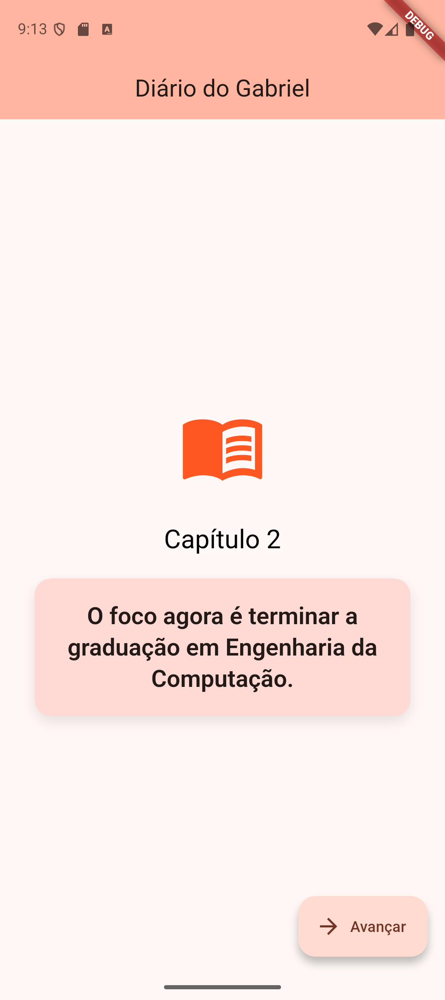
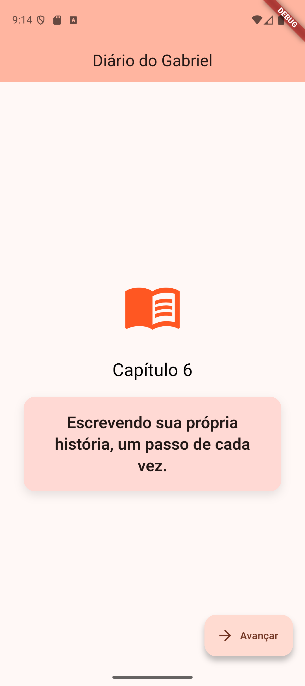

# my_first_app_flutter
 

# Interactive Diary - My First Flutter Project

This is my very first project developed in Flutter! It was created to put into practice the fundamental concepts of mobile development and state management that I have been learning on the <a href="https://www.dio.me/" target="_blank">DIO</a> platform.

## About the Project

The app was born as a creative evolution of Flutter's standard 'counter' project. Instead of simply adding numbers on a blank screen, I turned it into an **interactive story player**. 

## Project Screen

  
  

